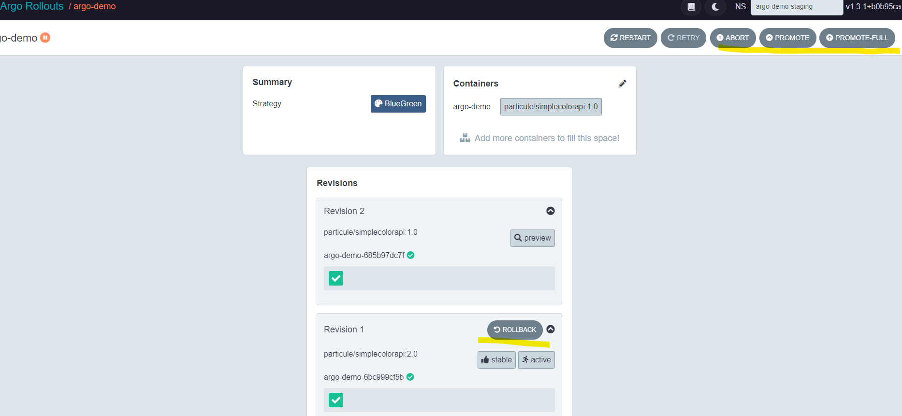
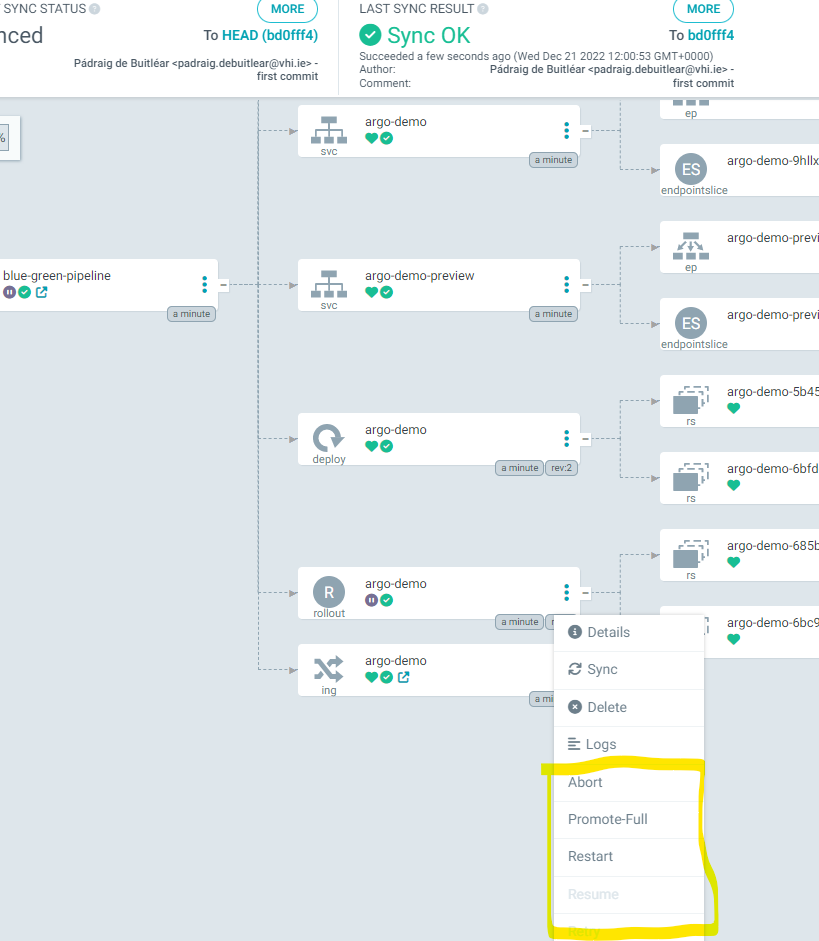

= Argo Rollouts - Kustomize examples on Kong/Nginx
// :source-highlighter: pygments 
:toc:

There are a number of different deployment stategies proved out in this repository.

== Pre-requisites

=== Istio Proxy
****
A minimal installation of Istio is required, i.e. IstioD only, istio-ingress gateway is no longer required. Please follow the steps in the Kong Istio Gateway instructions for more on doing a 'minimal' install.
****
=== Kong Istio Gateway

****
This repo assumes Kong istio gateway is installed and configured in the services deployed

Installation instructions for Kong Istio Gateway

* https://konghq.com/blog/istio-gateway
* https://docs.konghq.com/kubernetes-ingress-controller/latest/guides/getting-started-istio/

In-depth examples of Kong-Istio integration

* https://thecloudblog.net/post/enhancing-istio-operations-with-kong-istio-gateway/
* https://tech.aufomm.com/how-to-use-istio-with-kong-ingress-controller/  +  +

****
=== Argo CD
****
Main docs:

* https://argo-cd.readthedocs.io/en/stable/

Installation docs:

* https://argo-cd.readthedocs.io/en/stable/getting_started/

The CLI can be useful also:

* https://argo-cd.readthedocs.io/en/stable/cli_installation/

Please customise the ingress configuration appropriately and see the link above to the ArgoCD docs.

The kubectl plugin can be useful also:

* https://argoproj.github.io/argo-rollouts/installation/#kubectl-plugin-installation

The following deploys ArgoCD and the Extensions Controller (required below):

[source,bash,attributes]
----
kubectl create ns argocd && kustomize build . | kubectl apply -f - -n  argocd
----
****

=== Argo Rollouts
****
Main docs:

* https://argoproj.github.io/argo-rollouts/

Installation docs:

* https://argoproj.github.io/argo-rollouts/installation/

The Argo CD Extension for Rollouts is also required in order to promote deployments via the ArgoCD UI

* https://github.com/argoproj-labs/rollout-extension

The following deploys Argo Rollouts in its own namespace and installs > the Argo CD Rollouts extension:

[source,bash,attributes]
----
kubectl create namespace argo-rollouts

kubectl apply -n argo-rollouts -f https://raw.githubusercontent.com/argoproj/argo-rollouts/stable/manifests/install.yaml

kubectl apply -n argocd -f ArgoCDExtension/ArgoCDExtension.yaml
----
****

== Argo Rollouts User Interfaces

****
[discrete]
=====  Argo Rollouts dashboard

[source,bash,attributes]
----
kubectl argo rollouts dashboard &
----

'''

[discrete]
=====  ArgoCD Rollouts extension

Alternatively the promotion logic is also available directly via the ArgoCd UI: 

****

== Deployment Strategies - Blue Green

=== Via GitOps with ArgoCD:

****
[discrete]
===== Deploy the ArgoCD "Application" configuration

[source,bash,attributes]
----
kubectl apply -f blue-green.yaml
----

This will automatically deploy the initial version of the image as configured in the Kustomization file for this overlay.
Once the inital image is deployed we can proceed with a deployment of the "Green" image.

[discrete]
===== Update image

Lets configure the new image in the kustomize overlay and commit to GitHub

[source,bash,attributes]
----
( cd k8s/overlays/staging-blue-green/ && kustomize edit set image particule/simplecolorapi:2.0 )

git add . && git commit -m "pushing blue/green deployment" && git push
----

[discrete]
===== Port forward service & test

With the Blue/Green strategy ArgoCD will eventually (if webhook is not configured) deploy the "Green" instance of the service (not exposed externally) and it should be testable via port forwarding, E.g.

[source,bash,attributes]
----
kubectl port-forward svc/argo-demo-preview 8080:80 -n argo-demo-staging

curl -s  http://127.0.0.1:8080
----

[discrete]
===== Promotion of the deployment

Both the ArgoCD Rollouts extention, or the Argo Rollouts dashboard could be used to promote the Rollout as per the screenshots above.
Alternatively the CLI could be used:

[source,bash,attributes]
----
kubectl argo rollouts -n argo-demo-staging promote argo-demo
----

The promoted code can be tested via the Ingress as follows:

[source,bash,attributes]
----
export PROXY_IP=$(minikube service -n kong-istio kong-istio-kong-proxy --url | head -1)

curl -s -k $PROXY_IP -H "Host: rollouts-blue-green.lab"
----

'''

_CLI Commands when running Argo without ArgoCD_

Deploy overlay with Argo Rollouts CRD

[source,bash,attributes]
----
kubectl apply -k k8s/overlays/staging-blue-green/
----

Update image via Argo Rollouts CLI

[source,bash,attributes]
----
kubectl argo rollouts -n argo-demo-staging set image argo-demo argo-demo=particule/simplecolorapi:2.0
----

Monitoring via the Argo Rollouts kubectl plugin

[source,bash,attributes]
----
kubectl argo rollouts -n argo-demo-staging get rollout argo-demo -w
----

****
 

== Deployment Strategies - Canary strategy

=== Istio with VirtualServices Via GitOps with ArgoCD

****
[discrete]
===== Deploy the ArgoCD "Application" configuration

[source,bash,attributes]
----
kubectl apply -f canary-istio-vs.yaml
----

This will automatically deploy the initial version of the image as configured in the Kustomization file for this overlay.
Once the inital image is deployed we can proceed with a deployment of the "Canary" image.

[discrete]
===== Monitor API

Lets continuously monitor the Ingress requests in another terminal.

[source,bash,attributes]
----
while true; do curl -s -k https://rollouts-canary-vs.lab/ | jq .color; sleep 0.1; done
----

[discrete]
===== Update image

Lets configure the new image in the kustomize overlay and commit to GitHub

[source,bash,attributes]
----
( cd k8s/overlays/prod-canary-vs/ && kustomize edit set image particule/simplecolorapi:2.0 )
git add . && git commit -m "pushing blue/green deployment" && git push
----

[discrete]
===== Progressing the Rollout

Straight away we should start seeing 1 in 10 requests going to the Canary deployment, i.e.
returning a "blue" response from the API.
The deployment can be progressed with via the UI or using the following command

[source,bash]
----
kubectl argo rollouts -n argo-demo-prod-vs promote argo-demo
----

As the rollout progresses this is reflected in the responses from the Canary deployment.
See the help option on the Argo rollouts command for more info:

[source,bash]
----
kubectl argo rollouts -h
----

****

=== Canary traffic management options

****
This repo contains examples for 3 of the options for deploying code with the Canary strategy in Argo rollouts.
Those are the:

* https://argoproj.github.io/argo-rollouts/features/traffic-management/nginx/[Nginx]
 ** suitable for UI canary deployments potentially ( TODO: need to look into sticky sessions )
* https://argoproj.github.io/argo-rollouts/features/traffic-management/istio/#host-level-traffic-splitting[Istio - host level traffic splitting (VirtualServices)]
 ** Less CRDS that subset level traffic splitting
* https://argoproj.github.io/argo-rollouts/features/traffic-management/istio/#subset-level-traffic-splitting[Istio - subset level traffic splitting (VirtualServices and DestinationRules)]

With the implementation of the Gateway APIs in Kubernetes, this space will change and there will be more native capabilites in the Kubernetes CRDS.
Support in Kong similar to that in Nginx currently, is likely to accompany those Gateway API implmentations.
Removing the need to to use Istio for this purpose.
Its another option.
Istio covers North/South as well as East/West traffic management, Kong would only support traffic management for North/South traffic I suspect though.

****

== Necessary annotations to enable integration with the traffic management capabilies in Istio
****
[discrete]
===== Ingress annotation:
[source,yaml,attributes]
----
annotations:
  konghq.com/preserve-host: "false"
----

[discrete]
===== Service annotation:
[source,yaml,attributes]
----
  annotations:
    ingress.kubernetes.io/service-upstream: 'true'
----

****

== Suitability of Canary deployment strategy:

https://www.getambassador.io/docs/argo/latest/concepts/canary

== References

_Examples:_

https://particule.io/en/blog/argocd-canary/ https://github.com/christianh814/gitops-examples https://github.com/makocchan0509/bookinfo-manifests

_VirtualServices and DestinationRules_

https://istio.io/v1.1/docs/reference/config/networking/v1alpha3/virtual-service/
