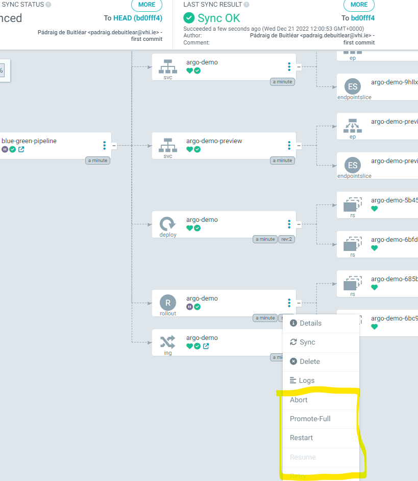

# Argo Rollouts - Kustomize examples on Kong/Nginx
There are a number of different deployment stategies proved out in this repository.

## Pre-requisites

### Kong Istio Gateway
> This repo assumes Kong istio gateway is installed and configured in the services deployed
> 
> #### Installation instructions for Kong Istio Gateway
> * https://konghq.com/blog/istio-gateway
> * https://docs.konghq.com/kubernetes-ingress-controller/latest/guides/getting-started-istio/
> 
> #### In-depth examples of Kong-Istio integration
> * https://thecloudblog.net/post/enhancing-istio-operations-with-kong-istio-gateway/
> * https://tech.aufomm.com/how-to-use-istio-with-kong-ingress-controller/
><br />
<br />

### Argo CD
> Main docs:
> * https://argo-cd.readthedocs.io/en/stable/
> 
> Installation docs: 
> * https://argo-cd.readthedocs.io/en/stable/getting_started/
> 
> The CLI can be useful also:
> * https://argo-cd.readthedocs.io/en/stable/cli_installation/
> 
> Please customise the ingress configuration appropriately and see the link above to the ArgoCD docs.
> 
> The kubectl plugin can be useful also:
> * https://argoproj.github.io/argo-rollouts/installation/#kubectl-plugin-installation
> 
> 
> The following deploys ArgoCD and the Extensions Controller (required below):
> ```
> kubectl create ns argocd && kustomize build . | kubectl apply -f - -n  argocd 
> ``` 
><br />
<br />

### Argo Rollouts
> Main docs:
> * https://argoproj.github.io/argo-rollouts/
> 
> Installation docs: 
> * https://argoproj.github.io/argo-rollouts/installation/
> 
> The Argo CD Extension for Rollouts is also required in order to promote deployments via the ArgoCD UI
> * https://github.com/argoproj-labs/rollout-extension
> 
> The following deploys Argo Rollouts in its own namespace and installs > the Argo CD Rollouts extension:
> ```
> kubectl create namespace argo-rollouts
> kubectl apply -n argo-rollouts -f https://raw.githubusercontent.com/argoproj/argo-rollouts/stable/manifests/install.yaml
> 
> kubectl apply -n argocd -f ArgoCDExtension/ArgoCDExtension.yaml
> ```
><br />
----
## Argo Rollouts User Interfaces
**Argo Rollouts dashboard**
```
kubectl argo rollouts dashboard &
```


</BR>

**ArgoCD Rollouts extension**

Alternatively the promotion logic is also available directly via the ArgoCd UI:


----

## Deployment Strategies


### Blue Green strategy - via GitOps with ArgoCD:

**Deploy the ArgoCD "Application" configuration**

></BR>

>```
>kubectl apply -f blue-green.yaml
>```
> This will automatically deploy the initial version of the image as configured in the Kustomization file for this overlay.
>Once the inital image is deployed we can proceed with a deployment of the "Green" image.

**Update image**
>
> Lets configure the new image in the kustomize overlay and commit to GitHub
>```
>( cd k8s/overlays/staging-blue-green/ && kustomize edit set image particule/simplecolorapi:2.0 )
>git add . && git commit -m "pushing blue/green deployment" && git push
>```


**Port forward service & test**
> With the Blue/Green strategy ArgoCD will eventually (if webhook is not configured) deploy the "Green" instance of the service (not exposed externally) and it should be testable via port forwarding, E.g. 
> ```
> kubectl port-forward svc/argo-demo-preview 8080:80 -n argo-demo-staging
> curl -s  http://127.0.0.1:8080
>```
>


**Promotion of the deployment**
> Both the ArgoCD Rollouts extention, or the Argo Rollouts dashboard could be used to promote the Rollout as per the screenshots above. 
> Alternatively the CLI could be used:
>```
>kubectl argo rollouts -n argo-demo-prod-vs-dr promote argo-demo
>```
>The promoted code can be tested via the Ingress as follows:
>```
> export PROXY_IP=$(minikube service -n kong-istio kong-istio-kong-proxy --url | head -1) 
>curl -s -k $PROXY_IP -H "Host: rollouts-blue-green.lab"
>```
>

*CLI Commands when running Argo without ArgoCD*
>Deploy overlay with Argo Rollouts CRD
>```
>kubectl apply -k k8s/overlays/staging-blue-green/
>```
>
>Update image via Argo Rollouts CLI
>```
>kubectl argo rollouts -n argo-demo-staging set image argo-demo argo-demo=particule/simplecolorapi:2.0
>```
>
>Monitoring via the Argo Rollouts kubectl plugin
>```
>kubectl argo rollouts -n argo-demo-staging get rollout argo-demo -w
>```
></BR>
</BR>


### Canary strategy - via GitOps with ArgoCD - Istio with VirtualServices only:

**Deploy the ArgoCD "Application" configuration**

></BR>

>```
>kubectl apply -f canary-istio-vs.yaml
>```
> This will automatically deploy the initial version of the image as configured in the Kustomization file for this overlay.
>Once the inital image is deployed we can proceed with a deployment of the "Canary" image.

**Monitor API**
> Lets continuously monitor the Ingress requests in another terminal.
>```
>while true; do curl -s -k https://rollouts-canary-vs.lab/ | jq .color; sleep 0.1; done
>```
>
></BR>
</BR>

**Update image**
>
> Lets configure the new image in the kustomize overlay and commit to GitHub
>```
>( cd k8s/overlays/prod-canary-vs/ && kustomize edit set image particule/simplecolorapi:2.0 )
>git add . && git commit -m "pushing blue/green deployment" && git push
>```


**Test**

while true; do curl -s -k https://rollouts-canary-vs.lab/ | jq .color; sleep 0.1; done


#### References - Examples:
https://particule.io/en/blog/argocd-canary/
https://github.com/christianh814/gitops-examples
https://github.com/makocchan0509/bookinfo-manifests

VirtualServices and DestinationRules
https://istio.io/v1.1/docs/reference/config/networking/v1alpha3/virtual-service/


## Argo CD

## Necessary annotations to enable integration with the traffic management capabilies in Istio

**Ingress annotation:**
```
annotations:
  konghq.com/preserve-host: "false"
```

**Service annotation:**
```
  annotations:
    ingress.kubernetes.io/service-upstream: 'true'
```


kubectl argo rollouts dashboard &

The Blue-Green strategy, which is is not dependent on service mesh or SMI is in the staging-blue-green kustomize overlay.

k apply -k argo-demo/k8s/overlays/prod-canary-vs/


Suitability of Canary deployments:
https://www.getambassador.io/docs/argo/latest/concepts/canary